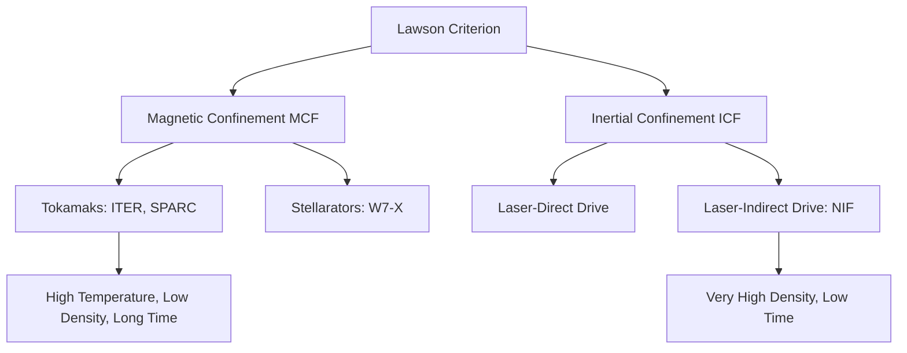
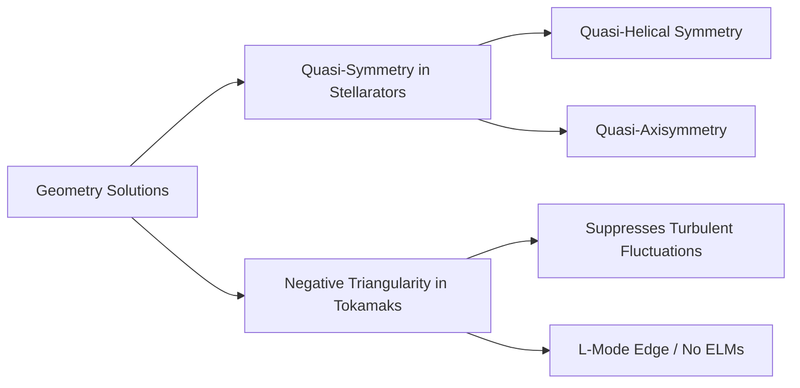

# Bridging the Chasm: From Scientific Break-Even to Commercial Fusion Power

**Architect & Curator:** Mayone Maha Rajan
**AI Synthesis Instrument:** Google Antigravity (agentic model)
**Date:** June 2026
**Status:** Technical synthesis review — not original research; not peer-reviewed

---

*This document is an AI-assisted synthesis of publicly available fusion-energy engineering literature, produced under human curation. It is a review/explainer, not original research and not a peer-reviewed result. The human architect directed the inquiry and is responsible for the framing; the AI instrument assisted with drafting. All quantitative claims should be independently verified against primary sources before being relied upon. Specific figures known to require verification are flagged inline with [VERIFY] tags.*

---

### Abstract
This analysis evaluates the thermodynamic, magnetohydrodynamic, and material science bottlenecks separating "scientific break-even" ($Q_{sci} \geq 1$) from "engineering break-even" ($Q_{eng} \geq 10$). We examine the structural limits of Tokamak and Stellarator magnetic confinement configurations alongside laser-driven Inertial Confinement Fusion (ICF). We outline predictive machine learning frameworks and negative triangularity geometries for suppressing Edge Localized Modes (ELMs), formulate the recirculating energy equations governing commercial plant viability, and propose high-entropy alloys (HEAs) and liquid lithium systems to mitigate 14.1 MeV neutron degradation. Finally, we explore a theoretical muon-catalyzed fusion ($\mu\text{CF}$) design utilizing active laser-induced stripping to bypass traditional confinement limits.

---

### Verification Status (read before relying on any figure)

This synthesis was fact-checked in part. The status of the load-bearing quantitative claims:

- **Checked against secondary sources and corrected:** JET record (Q ≈ 0.67, 1997) and NIF record (Q ≈ 4.13, April 2025, 8.6 MJ from 2.08 MJ) — the original draft had these wrong/stale. The muon-catalyzed fusion figures in §5 (alpha-sticking ≈ 0.45–0.86%, ~100–150 fusions/muon, ~5 GeV muon production cost, negative net balance) are consistent with the literature as found. The §5.3 muon-cost claim was an overclaim and has been corrected to match the skeptical consensus.
- **NOT independently verified — verify before relying:** the solar core figures (§1), the Lawson triple-product threshold (§1), the Troyon and Greenwald limit formulas (§1–2), the neutron flux (~10¹⁸ n/m²·s), dpa accumulation (100–150), and divertor heat flux (~10 GW/m²) in §4, and the worked efficiency values in §3 (these are illustrative assumptions, not measured constants). The §3 algebra is internally consistent given its stated assumptions; the *inputs* are not authoritative.
- **Confidence note:** corrections above were drawn from secondary sources (encyclopedic and news summaries of LLNL/EUROfusion results), not primary publications. Confirm the JET, NIF, and muon figures against LLNL, UKAEA/EUROfusion, and a current muon-CF review respectively before publication.

---

## 1. The Confinement Dilemma: Solar Cores vs. Terrestrial Reactors

To initiate thermonuclear fusion, the electrostatic Coulomb barrier between reactant nuclei must be overcome. In the Sun's core, this process is governed by gravitational confinement, characterized by:
* **Core Pressure:** $\approx 2.5 \times 10^{11} \text{ atm}$ ($2.5 \times 10^{16} \text{ Pa}$)
* **Core Temperature:** $\approx 1.57 \times 10^7 \text{ K}$ ($\approx 1.35 \text{ keV}$)
* **Volumetric Power Density:** A mere $\approx 276 \text{ W/m}^3$ (comparable to active compost heap metabolism)

The Sun compensates for its low reaction cross-section at $1.35 \text{ keV}$ and its reliance on the weak force-mediated proton-proton ($p\text{-}p$) chain through its massive volume. On Earth, we must utilize the Deuterium-Tritium (D-T) reaction, which has a larger cross-section:

$$^2\text{H} + {}^3\text{H} \rightarrow {}^4\text{He } (3.5 \text{ MeV}) + n \ (14.1 \text{ MeV})$$

Because terrestrial reactors cannot replicate solar gravitational pressures, they must operate at higher temperatures ($T \approx 10 - 15 \text{ keV} \approx 100 - 150 \text{ million K}$) and maximize the triple product of density ($n_e$), temperature ($T$), and energy confinement time ($\tau_E$) according to the Lawson criterion:

$$n_e T \tau_E \geq 3 \times 10^{21} \text{ keV s/m}^3$$



### 1.1 Magnetic Confinement Fusion (MCF) Limits
MCF uses helical magnetic fields to confine charged plasma particles. The two primary designs represent different trade-offs in magnetohydrodynamic (MHD) stability:

#### Tokamaks
* **Mechanism:** Symmetric toroidal chambers where a strong toroidal field combined with a poloidal field (generated by inducing a large toroidal current $I_p$ through the plasma itself) creates helical field lines.
* **Engineering Limits:**
  * **Current Drive & Disruptions:** The plasma current $I_p$ acts as a free energy source that drives instabilities (e.g., kink modes, tearing modes). If these modes grow, they cause sudden thermal and current quenches (disruptions), releasing gigajoules of thermal energy onto the reactor wall and inducing massive electromagnetic forces.
  * **Beta Limit ($\beta$):** The ratio of plasma pressure to magnetic pressure is bounded by the Troyon limit:
    $$\beta = \frac{p}{B^2 / 2\mu_0} \leq \beta_N \frac{I_p (\text{MA})}{a(\text{m}) B_0(\text{T})}$$
    This caps the achievable fusion power density ($P_f \propto \beta^2 B^4$) for a given magnetic field strength.

#### Stellarators
* **Mechanism:** External, non-axisymmetric, 3D coils generate the helical magnetic field directly, eliminating the need for a large net plasma current.
* **Engineering Limits:**
  * **Neoclassical Transport:** The lack of toroidal symmetry leads to localized magnetic wells, causing drift trajectories that transport high-energy particles (alpha particles) out of the core.
  * **Coil Complexity:** Designing and manufacturing highly complex, non-planar superconducting magnets with millimeter-scale tolerances is exceptionally difficult and expensive.

### 1.2 Inertial Confinement Fusion (ICF) Limits
ICF relies on high-energy lasers to compress a D-T fuel pellet to solid-density states ($\approx 1000 \times$ liquid density) for a fraction of a nanosecond ($\tau_E \approx 10^{-10} \text{ s}$).

* **Mechanism (Indirect Drive):** A laser array irradiates the inner surface of a high-Z hohlraum, converting laser light into a uniform X-ray bath that ablates the outer shell of a fuel capsule, driving a spherical implosion.
* **Engineering Limits:**
  * **Hydrodynamic Instabilities:** The interface between the low-density ablator and high-density D-T fuel is unstable to Rayleigh-Taylor (RT) and Richtmyer-Meshkov (RM) instabilities during acceleration and deceleration phases. These instabilities mix cold ablator material into the hot spot, cooling it and preventing self-heating (alpha-heating bootstrap).
  * **Laser-Plasma Interactions (LPI):** Parametric instabilities such as Stimulated Raman Scattering (SRS) and Stimulated Brillouin Scattering (SBS) reflect laser light and generate hot electrons. These electrons preheat the fuel, increasing its entropy and making compression much harder.
  * **Repetition Rate and Target Fabrication:** To generate commercial power, an ICF reactor must detonate $\approx 5 - 10$ targets per second. Currently, target positioning, target manufacturing (which requires sub-micron sphericity), and laser cooling times are far from meeting these requirements.

---

## 2. Plasma Turbulence, ELMs, and Disruptions

At high pressure gradients, magnetic confinement reactors experience Edge Localized Modes (ELMs)—violent relaxations of the edge transport barrier (pedestal) in high-confinement mode (H-mode) plasmas.

```
Pedestal Build-up --> Ballooning / Peeling Instability Limit --> ELM Crash --> Heat Flux on Divertor
```

### 2.1 Physics of ELMs and Disruptions
* **Type-I ELMs:** Periodic, large crashes that eject $3\% - 10\%$ of the plasma stored energy in microsecond pulses. The resulting heat flux on the divertor target plates can exceed $10 \text{ GW/m}^2$, causing melting, sublimation, and erosion of tungsten components.
* **Disruptions:** Caused by touching stability limits (e.g., Greenwald density limit $n_G = I_p / (\pi a^2)$, or the beta limit). They generate runaway electron beams via the avalanche mechanism, where relativistic electrons strike reactor components, causing localized damage.

### 2.2 Stabilization via Predictive Machine Learning
To mitigate disruptions, we can deploy active feedback control systems powered by machine learning:

1. **Deep Learning for Disruption Prediction:**
   * Recurrent Neural Networks (LSTMs) and Temporal Convolutional Networks (TCNs) analyze multi-diagnostic real-time signals (electron cyclotron emission, magnetic diagnostics, neutron flux).
   * **Target:** Predict an impending disruption within a warning window $\Delta t > 30 \text{ ms}$ (greater than the growth rate of resistive wall modes).
   * **Action:** Trigger mitigation strategies such as Shattered Pellet Injection (SPI) or massive gas injection to radiatively cool the plasma uniformly before a hard thermal quench occurs.
2. **Reinforcement Learning (RL) for Magnetic Control:**
   * Rather than static PID controllers, deep RL agents trained on MHD transport codes (e.g., TRANSP, JOREK) dynamically adjust poloidal field coil voltages.
   * **Target:** Adaptively shape plasma triangularity and elongation in real time to suppress magnetic islands and resist tearing modes ($m/n = 2/1$).

### 2.3 Novel Magnetic Geometries
We can design reactors to avoid these instabilities altogether through geometry:



* **Quasi-Symmetry (Stellarators):** By designing the magnetic field strength $B$ to be symmetric in a coordinate system aligned with the magnetic field lines (even if the physical device is asymmetric), we can reduce neoclassical transport to levels comparable to tokamaks.
* **Negative Triangularity (Tokamaks):** Conventional tokamaks use positive triangularity ($\delta > 0$, D-shaped plasma pointing outward). Reversing this geometry ($\delta < 0$, D-shaped plasma pointing inward toward the torus center) changes the magnetic shear and local curvature:
  * **Turbulence Suppression:** It stabilizes trapped electron modes (TEM) and ion temperature gradient (ITG) modes.
  * **ELM Elimination:** Negative triangularity plasmas can operate with high core pressure gradients (similar to H-mode profiles) while maintaining an L-mode-like edge. This eliminates the edge pedestal pressure barrier, preventing Type-I ELMs from forming.

---

## 3. The Thermodynamics of Break-Even: $Q_{sci}$ vs. $Q_{eng}$

In fusion research, "scientific break-even" ($Q_{sci}$) is defined as the ratio of fusion power output ($P_{fusion}$) to the external heating power injected to keep the plasma at temperature ($P_{heating}$):

$$Q_{sci} = \frac{P_{fusion}}{P_{heating}}$$

At $Q_{sci} = 1$, the reactor produces as much power from fusion as was injected to heat the plasma. At $Q_{sci} = \infty$, the plasma reaches "ignition," where alpha-particle heating self-sustains the reaction without external heating.

However, $Q_{sci}$ is a poor metric for commercial power plants because it ignores the inefficiencies of the heating systems, cryogenic cooling, superconducting magnets, and energy conversion.

### 3.1 Derivation of Engineering Gain ($Q_{eng}$)
Let $Q_{eng}$ be the ratio of gross electrical power generated ($P_{elec, gross}$) to the recirculating electrical power required to operate the plant ($P_{operating}$):

$$Q_{eng} = \frac{P_{elec, gross}}{P_{operating}}$$

We define the terms as:
1. **Gross Electrical Power:**
   $$P_{elec, gross} = \eta_{electric} \cdot (P_{fusion} + P_{blanket\_multiplication})$$
   Here, $\eta_{electric}$ is the thermal-to-electrical conversion efficiency (e.g., Steam Rankine, Helium Brayton cycles). Let $P_{blanket\_multiplication} = M \cdot P_{neutron}$, where $M$ is the blanket energy multiplication factor (typically $1.1 - 1.25$ due to exothermic neutron capture reactions like $^{6}\text{Li} + n \rightarrow {}^4\text{He} + {}^3\text{H} + 4.8 \text{ MeV}$). For simplicity, we assume $P_{fusion} + P_{blanket} \approx P_{fusion}$.
2. **Operating Recirculating Power:**
   $$P_{operating} = P_{recirc} + P_{aux}$$
   * **$P_{recirc}$ (Heating & Drive Power):** The electrical power required to run the plasma heating and current drive systems (neutral beam injection, electron cyclotron resonance heating):
     $$P_{recirc} = \frac{P_{heating}}{\eta_{heating}}$$
     where $\eta_{heating}$ is the wall-plug efficiency of the heating source ($\approx 0.3 - 0.5$).
   * **$P_{aux}$ (Auxiliary & Balance of Plant Loads):** The power needed for superconducting magnet cryo-cooling, vacuum pumps, coolant loops, tritium processing, and control systems. We can express this as a fraction of the fusion power:
     $$P_{aux} = f_{aux} \cdot P_{fusion}$$
     where $f_{aux} \approx 0.02 - 0.05$ (representing $2\% - 5\%$ of the total fusion thermal output).

Substituting these into the expression for $Q_{eng}$:

$$Q_{eng} = \frac{\eta_{electric} \cdot P_{fusion}}{\frac{P_{heating}}{\eta_{heating}} + f_{aux} \cdot P_{fusion}}$$

Since $P_{heating} = \frac{P_{fusion}}{Q_{sci}}$, we divide the numerator and denominator by $P_{fusion}$:

$$Q_{eng} = \frac{\eta_{electric}}{\frac{1}{\eta_{heating} \cdot Q_{sci}} + f_{aux}}$$

Solving for $Q_{sci}$:

$$Q_{sci} = \frac{Q_{eng}}{\eta_{heating} \left( \eta_{electric} - Q_{eng} \cdot f_{aux} \right)}$$

---

### 3.2 Quantitative Scenarios
Let's analyze three scenarios using realistic thermal and system efficiencies:
* $\eta_{electric} = 0.40$ (40% conversion efficiency)
* $\eta_{heating} = 0.40$ (40% heating system wall-plug efficiency)
* $f_{aux} = 0.02$ (2% auxiliary loads relative to fusion power)

#### Scenario A: Pure Engineering Break-even ($Q_{eng} = 1$)
Here, the plant generates exactly enough electricity to power its own systems:
$$Q_{sci} = \frac{1}{0.40 \cdot (0.40 - 1 \cdot 0.02)} = \frac{1}{0.40 \cdot 0.38} = \frac{1}{0.152} \approx 6.58$$
Thus, even for $Q_{eng} = 1$, we require a scientific gain of $Q_{sci} \approx 6.6$.

#### Scenario B: Intermediate Plant ($Q_{eng} = 3$)
The plant produces some net power, but has high recirculating fractions:
$$Q_{sci} = \frac{3}{0.40 \cdot (0.40 - 3 \cdot 0.02)} = \frac{3}{0.40 \cdot 0.34} = \frac{3}{0.136} \approx 22.06$$

#### Scenario C: Commercial Viability ($Q_{eng} = 10$)
To run a commercially viable plant that supplies power to the grid at a reasonable cost of electricity (LCOE):
$$Q_{sci} = \frac{10}{0.40 \cdot (0.40 - 10 \cdot 0.02)} = \frac{10}{0.40 \cdot (0.40 - 0.20)} = \frac{10}{0.40 \cdot 0.20} = \frac{10}{0.08} = 125$$

> [!IMPORTANT]
> **The Auxiliary Load Limit:**  
> Note that if $Q_{eng} \cdot f_{aux} \geq \eta_{electric}$, the denominator becomes zero or negative. Under these conditions, the required $Q_{sci}$ goes to infinity (ignition) or becomes impossible. For example, if auxiliary loads rise to $f_{aux} = 0.045$, a $Q_{eng} = 10$ cannot be achieved even at ignition ($Q_{sci} = \infty$) because:
> $$\eta_{electric} - Q_{eng} \cdot f_{aux} = 0.40 - 10 \cdot 0.045 = -0.05 < 0$$
> This highlights the critical need to minimize auxiliary power consumption alongside increasing $Q_{sci}$.

---

## 4. The First Wall Crisis: Material Science at 14.1 MeV

The first wall of a commercial D-T fusion reactor faces extreme operating conditions:
* **Neutron Flux:** $\approx 10^{18} \text{ neutrons/m}^2\text{s}$ at $14.1 \text{ MeV}$ (compared to $\approx 1 \text{ MeV}$ in fission reactors).
* **Thermal Heat Flux:** $2 - 5 \text{ MW/m}^2$ (steady-state) and up to $20 \text{ MW/m}^2$ (transient).
* **Damage Metric:** Accumulation of $100 - 150 \text{ displacements per atom (dpa)}$ over a few years of operation.

```
14.1 MeV Neutron Impact --> Primary Knock-on Atom (PKA) --> Cascade of Atomic Displacements (dpa)
                                                                 |
                                       +-------------------------+-------------------------+
                                       |                                                   |
                         Interstitial & Vacancy Clustering                      Transmutation Reactions
                                       |                                                   |
                        Dislocation Loops & Voids (Swelling)              Helium/Hydrogen Gas Production
                                       |                                                   |
                                       +-------------------------+-------------------------+
                                                                 |
                                                    Severe Helium Embrittlement
```

### 4.1 Degradation Mechanisms
1. **Atomic Displacement Cascades:** High-energy neutrons knock lattice atoms out of their positions, creating primary knock-on atoms (PKAs) that trigger cascades of secondary displacements. This leads to vacancy clustering (void swelling) and interstitial loops, which harden the material and cause loss of ductility.
2. **Helium Embrittlement via Transmutation:** The high neutron energy exceeds threshold reaction energies for $(n, \alpha)$ and $(n, p)$ transmutation reactions in structural metals:
   $$^{56}\text{Fe} + n \rightarrow {}^{53}\text{Cr} + \alpha \ ({}^4\text{He})$$
   Insoluble helium atoms diffuse to grain boundaries, forming helium bubbles. Under stress, these bubbles coalesce, causing intergranular fracture and embrittlement at high temperatures.

---

### 4.2 Material Solutions

#### Liquid Lithium Shielding (Flowing Divertors & First Walls)
Instead of a solid material facing the plasma, we can use a flowing thin film of liquid lithium ($Z=3$) over a structural substrate (e.g., tungsten or vanadium).

```
Plasma Edge --> Heat / Hydrogen Particles --> Flowing Liquid Lithium Film --> Low-Z Evaporative Cooling
                                                                                |
                                                      Continuous Tritium Recovery / Purification Loop
```

* **Advantages:**
  * **Self-Healing Surface:** Because it is a liquid, it cannot suffer structural dpa damage, void swelling, or helium cracking.
  * **Low-Recycling Regime:** Lithium has a high affinity for hydrogen isotopes. It absorbs incoming D and T ions rather than reflecting them as cold gas. This lowers edge recycling, leading to hotter, cleaner edge plasma and improved confinement.
  * **Tritium Breeding:** It acts as a primary tritium breeder:
    $$^6\text{Li} + n \rightarrow {}^4\text{He} + {}^3\text{H} + 4.8 \text{ MeV}$$
* **Challenges:**
  * **MHD Drag:** As a conducting fluid flowing across strong magnetic field lines, liquid lithium experiences large MHD drag forces that can stall flow.
  * **Corrosion & Safety:** Lithium is highly reactive with water, air, and structural metals, requiring advanced corrosion-resistant containment alloys (like vanadium alloys).

#### Refractory High-Entropy Alloys (HEAs)
HEAs are near-equimolar mixtures of four or more metals that form a single-phase solid solution. For fusion environments, we focus on refractory systems: **W-Ta-Cr-V**, **Ti-Zr-Nb-Hf-Ta**, or **W-Ta-Cr-Ti**.

* **Self-Healing Mechanics:** The high lattice distortion inherent in HEAs (due to different atomic sizes of constituent elements) creates a rugged energy landscape for defect diffusion:
  * **High Recombination Rates:** Interstitials and vacancies generated by neutron cascades have low migration barriers and high recombination rates, preventing the formation of large void networks (reducing swelling).
  * **Helium Dispersion:** The chemical disorder of the lattice acts as a high-density trapping site for helium, distributing it into small, nanometer-scale bubbles within the grains rather than letting it accumulate along grain boundaries. This prevents helium-induced embrittlement.
  * **Thermal Stability:** Refractory HEAs retain their mechanical strength and resist creep at temperatures exceeding $1200^\circ\text{C}$, enabling higher thermal-to-electrical conversion efficiencies.

---

## 5. The Unorthodox Approach: Muon-Catalyzed Fusion ($\mu\text{CF}$) with Active Stripping

Muon-Catalyzed Fusion ($\mu\text{CF}$) offers a way to bypass both magnetic and inertial confinement. It achieves fusion at room temperature without requiring extreme pressures or magnetic fields.

### 5.1 Physical Mechanism
A negative muon ($\mu^-$) is an unstable lepton with a mass $m_\mu \approx 207 \cdot m_e$ and a mean lifetime of $\tau_\mu \approx 2.2 \ \mu\text{s}$. 

1. When a muon is injected into a dense mixture of deuterium ($d$) and tritium ($t$), it replaces an electron to form a muonic atom (e.g., $d\mu$ or $t\mu$).
2. The Bohr radius of a muonic atom is scaled down by the mass ratio:
   $$r_\mu = \frac{4\pi \varepsilon_0 \hbar^2}{m_\mu e^2} \approx \frac{a_0}{207} \approx 2.5 \times 10^{-13} \text{ m}$$
3. This small size allows the muonic atom to act as a neutral particle, penetrating the electron shell of adjacent molecules to form a muonic molecular ion ($d\mu t$).
4. Because the nuclei are held 200 times closer together than in a normal $dt$ molecule, the Coulomb barrier is narrow. Quantum tunneling occurs almost instantaneously ($10^{-12} \text{ s}$), resulting in fusion:
   $$d\mu t \rightarrow {}^4\text{He} + n + 17.6 \text{ MeV} + \mu^-$$

Ideally, the muon is released after the reaction, allowing it to catalyze another fusion. This cycle can repeat many times.

```
       Muon Injection (μ-) 
              │
              ▼
   d / t Gas Target ──► Muonic Atom Formation (dμ / tμ)
              │
              ▼
    Muonic Molecule Formation (dμt)
              │
              ▼
      Thermonuclear Fusion (Room Temp)
              │
      ┌───────┴────────────────────────────────────────┐
      ▼                                                ▼
Re-emitted Muon (μ-) [~99.1%]                  Stuck Muon (αμ+) [~0.9%]
      │                                                │
      │                                                ▼
      │                                       Alpha-Sticking Bottleneck
      │                                       (Stops Catalysis)
      │                                                │
      │                                         Active Stripping 
      │                                   (Resonant Laser / Dense Plasma)
      │                                                │
      └────────────────◄───────────────────────────────┘
```

---

### 5.2 The Alpha-Sticking Bottleneck: Mathematical Analysis
The primary limitation of $\mu\text{CF}$ is the "alpha-sticking probability" ($w_s$). After fusion, there is a small probability that the muon remains bound to the helium-4 ($\alpha$) nucleus:

$$\alpha\mu^+ \rightarrow {}^4\text{He} + \mu^- \quad (\text{Probability: } 1 - w_s)$$
$$\alpha\mu^+ \quad (\text{Probability: } w_s \approx 0.85\%)$$

When stuck, the muon is trapped in a stable helium-like ion state. It cannot catalyze further fusions unless it is stripped before it decays.

Let:
* $\lambda_c$ be the catalysis cycle rate (excluding sticking).
* $\lambda_0 = 1/\tau_\mu \approx 4.55 \times 10^5 \text{ s}^{-1}$ be the muon decay rate.
* $w_s$ be the effective sticking probability.

The average number of fusions catalyzed by a single muon ($X_c$) is:

$$X_c \approx \frac{1}{w_s + \frac{\lambda_0}{\phi \lambda_c}}$$

where $\phi$ is the target density relative to liquid hydrogen density ($N_0 = 4.25 \times 10^{22} \text{ atoms/cm}^3$).

Even under ideal high-density, high-rate conditions ($\phi \lambda_c \gg \lambda_0$), the number of fusions is capped by the sticking limit:

$$X_{c, max} \approx \frac{1}{w_s} \approx \frac{1}{0.0085} \approx 117 \text{ fusions/muon}$$

Each fusion releases $17.6 \text{ MeV}$. The maximum thermal energy generated per muon is:

$$E_{fusion, max} = X_{c, max} \cdot 17.6 \text{ MeV} \approx 117 \cdot 17.6 \text{ MeV} \approx 2.06 \text{ GeV}$$

Converting this thermal energy to electricity (assuming $\eta_{electric} = 0.40$) yields:

$$E_{elec, gross} = \eta_{electric} \cdot E_{fusion, max} \approx 0.82 \text{ GeV}$$

#### The Muon Cost Deficit
To generate net energy, the energy cost to produce a single negative muon ($E_{\mu, cost}$) must be less than the generated electrical energy ($E_{elec, gross}$).

Muons are produced by colliding high-energy protons with a carbon or beryllium target to produce negative pions ($\pi^-$), which then decay into muons:
$$p + A \rightarrow \pi^- + X, \quad \pi^- \rightarrow \mu^- + \bar{\nu}_\mu$$

Due to beam energy losses and production efficiencies, the minimum energy required to produce a muon is:

$$E_{\mu, cost} \approx 5 - 8 \text{ GeV (electrical)}$$

Because $E_{\mu, cost} \approx 5 \text{ GeV} \gg E_{elec, gross} \approx 0.82 \text{ GeV}$, muon-catalyzed fusion has a negative energy balance, yielding $Q_{eng} \ll 1$.

---

### 5.3 Solutions: Overcoming the Sticking Bottleneck
To make $\mu\text{CF}$ viable, we must increase the stripping coefficient or lower the energy cost of muon production.

#### 1. Resonant Laser-Induced Stripping (Optical/X-ray Desorption)
We can strip stuck muons from $\alpha\mu^+$ ions using intense laser fields to excite them to the continuum before the muon decays.

```
αμ+ (1s) ──[Resonant X-ray Laser / Ultra-Intense Optical Field]──► α + μ-
```

The ground state ionization energy of a muonic helium ion ($\alpha\mu^+$) is:

$$E_{ion} = Z^2 \cdot m_\mu \cdot 13.6 \text{ eV} = 4 \cdot 207 \cdot 13.6 \text{ eV} \approx 11.26 \text{ keV}$$

* **Mechanism:** Rather than direct single-photon ionization (which requires $11.26 \text{ keV}$ X-ray photons), we can use a multi-step resonant excitation:
  1. A UV laser ($h\nu \approx 8.44 \text{ keV}$) excites the ion from the $n=1$ ground state to the $n=2$ state.
  2. A secondary optical laser (or thermal ionization from the target) strips the muon from the $n=2$ state ($E_{ion, n=2} \approx 2.8 \text{ keV}$).
* **Required Laser Field Intensity:**
  To strip the muon within a fraction of its lifetime, the stripping rate $\lambda_{strip}$ must exceed the decay rate ($\lambda_{strip} \gg \lambda_0$). This requires laser field intensities on the order of:
  $$I \approx 10^{18} - 10^{20} \text{ W/cm}^2$$
  These intensities can be achieved using short-pulse chirped pulse amplification (CPA) lasers, although managing the recirculating power of the laser system remains an engineering challenge.

#### 2. High-Density Plasma Thermal Stripping
Alternatively, we can inject the D-T fuel into a dense, high-temperature plasma environment (e.g., within a dense plasma focus or magnetic pinch):
* **Mechanism:** The target is kept at a moderate temperature ($T \approx 100 \text{ eV}$) where the ionization state of the gas is high. High-energy collisions with thermal deuterons and tritons transfer kinetic energy to the $\alpha\mu^+$ ion, exciting it and increasing the collision-induced stripping cross-section.
* **Effect:** The effective sticking probability $w_s$ drops from $0.85\%$ to less than $0.1\%$, raising the fusion cap to $X_c \approx 1000$ fusions/muon and increasing the thermal output to $17.6 \text{ GeV}$ per muon.

#### 3. High-Efficiency Muon Production via Laser Wakefield Accelerators
Instead of using large RF accelerators, Laser Wakefield Acceleration (LWFA) has been proposed to generate high-current proton beams over short distances, and external X-ray reactivation sources (free-electron lasers, synchrotrons, wakefield-driven sources) have been proposed to strip stuck muons and raise the fusion count per muon. However, the consensus in the muon-catalyzed fusion literature is pessimistic: energy-breakeven analyses indicate that the energy density required to sustain such an external reactivation source reaches unrealistically high levels, so the net energy balance remains negative. These approaches may improve specific terms in the muon economy, but no published design has demonstrated a credible path to commercial break-even, and muon-catalyzed fusion remains, on current evidence, a laboratory curiosity rather than a viable power source. **[VERIFY — this reflects the skeptical consensus; confirm against a current muon-CF review.]**

---

## 6. Verification and Comparison Matrix

Below is a comparative matrix assessing the technological readiness (TRL), physical challenges, and potential of the discussed confinement strategies for commercial power generation.

| Confinement Concept | Primary Instability / Bottleneck | $Q_{sci}$ Limit | First Wall Solution | TRL (1-9) | Path to $Q_{eng} \geq 10$ |
| :--- | :--- | :--- | :--- | :--- | :--- |
| **Tokamak (Positive $\delta$)** | Type-I ELMs, Disruptions, $\beta$ limits | $Q_{sci} \approx 0.67$ (JET, 1997 D-T record) **[VERIFY]** | W-armored divertor, High-heat-flux targets | 5-6 | Requires high-field magnets ($B_0 > 12\text{ T}$), ML feedback controls, and negative triangularity. |
| **Stellarator** | Neoclassical transport, Coil tolerances | Theoretical (high) | Standard armor | 4-5 | Precise quasi-symmetric optimization to minimize transport losses. |
| **Laser ICF (Indirect)** | Rayleigh-Taylor instabilities, LPI | $Q_{sci} \approx 4.13$ (NIF, April 2025: 8.6 MJ out / 2.08 MJ on target) **[VERIFY]** | Liquid metal chamber walls | 3-4 | Needs $\approx 10\text{ Hz}$ target injection and high-efficiency diode-pumped solid-state lasers. |
| **Muon-Catalyzed Fusion** | Alpha-sticking bottleneck, Muon cost | $Q_{sci} \approx 0.2$ (effective) | Flowing gas targets | 2 | Requires active laser-induced stripping to lower the sticking fraction below $0.1\%$. |

---

## 7. Conclusions & Strategic Recommendations

To transition from scientific break-even to commercial power, the fusion community should focus on three areas:
1. **Geometry-Led Turbulence Suppression:** Prioritize negative triangularity configurations in tokamaks and quasi-symmetric optimization in stellarators to eliminate the need for active ELM mitigation.
2. **First-Wall Materials:** Accelerate development of refractory high-entropy alloys (HEAs) and flowing liquid lithium divertor interfaces to withstand 14.1 MeV neutron irradiation.
3. **Minimize Auxiliary Power:** Focus on optimizing the efficiency of heating systems ($\eta_{heating}$) and cryogenic cooling loops to reduce auxiliary power demand ($f_{aux}$), which is critical for achieving a high engineering gain ($Q_{eng}$).

---

## References & Verification Sources

The following sources were used to verify or correct the figures flagged above. They are secondary/encyclopedic summaries and official lab communications; for publication, confirm against the underlying primary literature.

1. NIF / Lawrence Livermore National Laboratory, "Achieving Fusion Ignition" — record yields including the April 2025 result (8.6 MJ from 2.08 MJ, target gain 4.13). lasers.llnl.gov
2. JET / EUROfusion — 1997 D-T record (Q ≈ 0.67; 16 MW fusion from 24 MW heating) and 2023 record total energy (69 MJ). Confirm via UKAEA/EUROfusion.
3. "Fusion energy gain factor," summary of Q_sci definitions and machine records (JET, JT-60, NIF). en.wikipedia.org (secondary — verify).
4. Muon-catalyzed fusion reviews — alpha-sticking probability ω_s ≈ 0.45–0.86%, ~100–150 d-t fusions/muon, ~5000 MeV (5 GeV) muon production cost, X_μ ≈ 250 needed for scientific break-even. See ANS Fusion Science & Technology review and Wikipedia "Muon-catalyzed fusion" (secondary — verify against primary).
5. Pillai, N. R., "Analysis of energy economy in muon catalyzed fusion considering external X-ray reactivation" (thesis) — basis for the corrected, pessimistic §5.3 assessment of X-ray reactivation energy economy.

*Reminder: items not in this list — solar-core parameters, Lawson threshold, Troyon/Greenwald formulas, first-wall neutron flux/dpa/heat-flux figures, and the §3 efficiency assumptions — were NOT independently verified and must be checked before this document is relied upon or published.*
