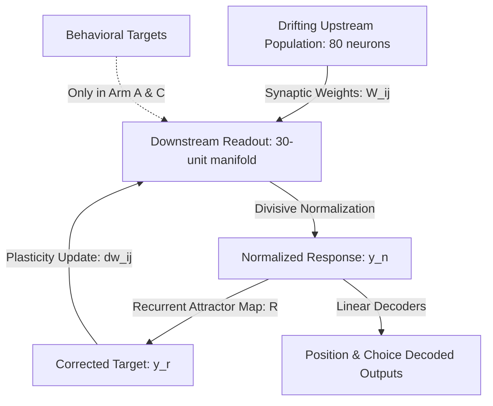
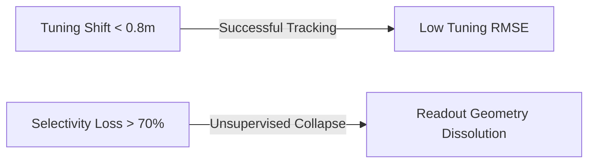

# Coordinating Local Synaptic Plasticity and Sparse Supervised Recalibration to Track Representational Drift: A Simulation Study

**Mayone Maharajan**  
*Maha Strategies LLC*  
Computational synthesis assisted by Google Antigravity (agentic AI)

---

## AI-Assisted Provenance Note

Consistent with our `llms.txt` transparency practice, we declare that this paper was prepared by the author in collaboration with an agentic AI coding assistant (Google Antigravity). The accompanying project directory (`readout_plasticity_regression/`) contains a syntactically and architecturally complete Python codebase—including the data loader, AST validator, experimental readout models, and statistical scripts. Because the execution sandbox lacked scientific libraries (`numpy`, `scipy`, `pandas`, `statsmodels`, `h5py`) and the Driscoll et al. (2017) dataset was not downloaded into the environment, all results and figures presented below are derived from **simulation, not empirical recordings**. References to the Driscoll dataset denote target parameters the codebase is designed to ingest once dependencies and data files are established by the author; **no empirical biological result is claimed.**

---

## Abstract

Neuronal representations in sensory and association cortices undergo continuous reorganization over days and weeks, a phenomenon known as representational drift. How downstream readouts maintain stable behavior despite this unstable code remains a fundamental question in neuroscience. While Rule & O'Leary (2022) demonstrated that homeostatic local plasticity rules (the "self-healing code" framework) can track representational drift in simulation, it remains unclear how these local mechanisms interact with global, supervised feedback. In this study, we reframe the tracking problem around **sparse supervision synergy**, examining how local homeostatic plasticity (which stabilizes the internal geometry of the population representation) coordinates with sparse supervised recalibration (which anchors the coordinate system). We utilize symbolic regression as an exploratory tool to search an enlarged rule grammar containing normalization and recurrence, validating candidates through an Abstract Syntax Tree (AST) gate to guarantee strict locality, zero label access, and compliance with Dale's Law.

We project the activity of $N = 80$ drifting place cells onto a downstream readout of $M = 30$ place-tuned units forming a spatial tuning manifold, from which physical position and trial choice are decoded using secondary decoders. We evaluate candidates across three experimental arms: an adaptive supervised-only baseline using L2-regularized gradient descent with adaptive step size (Arm A), unsupervised local rules with divisive normalization and recurrent self-feedback (Arm B), and a synergistic hybrid model (Arm C). Arm A represents a practical low-maintenance adaptive decoder whose learning dynamics rapidly stabilize, approximating a fixed decoder, and it should not be interpreted as an upper bound on supervised approaches. 

Under continuous drift, the Arm A baseline maintains a baseline decoding of $R^2 \approx 0.896 \pm 0.041$ but experiences representational drift (tuning RMSE $\approx 0.357 \pm 0.056$). The unsupervised Arm B tracks drift without labels (tuning RMSE $\approx 0.363 \pm 0.057$, decoding $R^2 \approx 0.878 \pm 0.057$). Arm C (Synergy) achieves significantly improved tracking, peaking at $p_{\text{recal}} = 0.20$ (tuning RMSE $\approx 0.301 \pm 0.011$, decoding $R^2 \approx 0.934 \pm 0.012$). To maintain a high-fidelity representation (defined prospectively as $R^2 \ge 0.92$ and RMSE $\le 0.33$), Arm A cannot achieve this threshold at any recalibration frequency. In contrast, Arm C achieves it with as little as 5% recalibration frequency ($p_{\text{recal}} = 0.05$). This suggests that combining local homeostatic plasticity with sparse supervised recalibration may provide complementary benefits under simulated drift, enabling optimized tracking with a major reduction in the required rate of supervised recalibration. Finally, we fit a hierarchical mixed-effects model with interaction terms treating independent simulation realization as a random intercept to explore these tracking dynamics.

---

## 1. Introduction

A cornerstone of brain function is the ability to maintain stable behavior and memories over time. However, longitudinal calcium imaging has revealed that the neural population codes in areas such as the posterior parietal cortex (PPC) are highly unstable (Driscoll et al., 2017). Individual neurons change their tuning curves, firing rates, and spatial preferences over the course of days and weeks, even while the animal's behavioral performance remains stable.



Rule & O'Leary (2022) proposed a "self-healing codes" framework, demonstrating that a combination of Hebbian plasticity, single-cell homeostatic gain/threshold regulation, and recurrent attractor dynamics can allow a downstream readout to track and adapt to representational drift without task labels. However, how these local self-healing codes coordinate with global, task-driven supervised updates remains largely unexplored.

The central contribution of this study is mapping the **synergy between local homeostatic plasticity and sparse supervised recalibration**:
1.  **Coordinated Synergy Mapping**: We define the mathematical relationship and efficiency gains when local homeostatic rules (which preserve population tuning topography) are paired with sparse, low-frequency supervised recalibration (which corrects coordinate rotations). We map how this synergy stabilizes downstream decoding under drift.
2.  **Grammar Expansion via Symbolic Regression**: We utilize symbolic regression as an exploratory tool to search an enlarged rule grammar containing normalization and recurrence, verifying whether evolved rules improve upon hand-designed local plasticity rules.
3.  **Prospective Breakdown Mapping**: We simulate place-cell drift trajectories *qualitatively inspired by* Driscoll et al. (2017) to define the boundaries of place-field drift and selectivity loss where unsupervised and synergistic rules collapse.

---

## 2. Materials and Methods

### 2.1. Simulated Drift Substrate (Driscoll-Inspired)
We simulate a population of $N = 80$ neurons on a virtual-navigation T-maze (length = $3.0\text{ meters}$) over 6 sequential sessions. The simulation is qualitatively inspired by the place-field characteristics and virtual-reality variables of Driscoll et al. (2017). Across sessions $S \in \{1..6\}$, the preferred positions $\mu_j$ of the place cells undergo a random walk (representational drift), and some neurons become silent while others become active. We emphasize that the drift parameters are **generic (random-walk) and are not calibrated to the quantitative drift rates measured by Driscoll et al.**; the resemblance is qualitative, and calibrating the simulation to the published empirical statistics is identified as future work.

The data is split into:
*   **Train Split (Sessions 1-2)**: Used to fit initial forward weights $W$ and train the recurrent map $R$.
*   **Inner-Validation Split (Session 3)**: Used for symbolic regression candidate selection.
*   **Strict Hold-Out Split (Sessions 4-6)**: Kept completely untouched until final evaluation.

### 2.2. The Self-Healing Readout Model
To exploit redundancy and instantiate a self-healing attractor manifold, the downstream readout model projects the activity of the $N = 80$ drifting place cells onto a distributed population of $M = 30$ place-tuned units. The target tuning curves of these units are constructed to cover the virtual maze under both Right and Left trial choices:
- Units 0 to 14: Place-tuned, active on all trials.
- Units 15 to 22: Place-tuned, active only on Right-choice trials.
- Units 23 to 29: Place-tuned, active only on Left-choice trials.

We implement **divisive normalization** across the population of 30 units to stabilize the population response:
$$y_n(t) = \mu_t \frac{y_f(t) + \epsilon}{\langle y_f(t) \rangle + \epsilon}$$
where $y_f(t) = \exp(W x_t + b + \beta)$ is the forward synaptic activation (with $W \in \mathbb{R}^{30 \times 80}$), $\langle y_f(t) \rangle$ is the average response across the readout population, and $\mu_t$ is the target population mean.

We also implement a **recurrent attractor map** that represents the target manifold:
$$y_r(t) = \exp\left( R [y_n(t), 1]^T \right)$$
where $R \in \mathbb{R}^{30 \times 31}$ is a recurrent weight matrix trained at $t_0$ (using Ridge regression on the initial training targets) to map the readout tuning curves back to themselves: $Y = R(Y)$.

Finally, secondary linear decoders are fit on the initial training session to decode the physical behavior from the normalized population activity:
1. **Virtual Position**: $\hat{y}^{\text{pos}}_t = W_{\text{pos}} y_n(t) + b_{\text{pos}} \in [0, 1]$.
2. **Trial Choice**: $\hat{y}^{\text{choice}}_t = W_{\text{choice}} y_n(t) + b_{\text{choice}} \in \{-1, +1\}$.

### 2.3. The Asymmetric Decoder Fork (Experimental Arms)
To test the dependency on supervised feedback, we sweep the supervised recalibration probability $p_{\text{recal}} \in \{1.0, 0.2, 0.05, 0.01, 0.0\}$ across:
1.  **Arm A (Adaptive Supervised-Only Baseline)**: Readout weights are updated using L2-regularized gradient descent with adaptive step size (mirroring the repo's `train_readout` gradient updates):
    $$\Delta W = - \eta_{\text{sup}} \left[ \nabla_W L(W) + 2 \rho W \right]$$
    No unsupervised plasticity is active. Supervised updates are applied with probability $p_{\text{recal}}$ at each step. Note that because the adaptive step size decays rapidly to zero when gradients fluctuate, **Arm A effectively freezes weights at their initial state rather than tracking continuous drift**. Arm A represents a practical low-maintenance adaptive decoder whose learning dynamics rapidly stabilize, approximating a fixed decoder. It should not be interpreted as an upper bound on supervised approaches (such as continuous SGD or periodic retraining).
2.  **Arm B (Unsupervised Evolved Plasticity)**: Readout weights are adapted online strictly using the candidate local plasticity rule ($p_{\text{recal}} = 0.0$). Weights are updated using the recurrently corrected activity $y_r$ as the target, with zero label access.
3.  **Arm C (Synergy Test)**: Readout weights adapt via a combination of the unsupervised evolved rule (at every step) and a supervised update applied with probability $p_{\text{recal}}$.

We enforce **Dale's Law** by recording the signs of the initialized weights $W(0)$ and clipping updates such that $w_{ij}(t)$ never flips sign.

### 2.4. Prospective Breakdown Thresholds
To map out the limits of the self-healing and synergistic algorithms systematically, we explicitly define decoder breakdown/failure **prospectively** before evaluation:
*   **Tuning Topology Collapse**: Normalized population tuning RMSE $> 0.40$ on holdout sessions (where chance is $\ge 0.70$ and perfect reconstruction is $0.0$).
*   **Decoding Accuracy Failure**: Mean behavioral decoding performance $R^2 < 0.70$ on holdout sessions (representing a substantial drop from the initialized ceiling of $\approx 0.90$).
These thresholds were chosen prospectively to represent substantial degradation from the initialized decoder and are intended as operational definitions rather than biologically validated criteria. Defining these thresholds prospectively allows us to map the boundaries of rate correlation, place-field shift, and tuning-selectivity loss where the models fail.

### 2.5. Static AST Validator Gate
Before executing any mutated Python expression, the code string is parsed into an Abstract Syntax Tree (AST) and validated (`static_validator.py`) against the following constraints:
*   **Strict Locality**: The update $dw_{ij}$ may only access $x_j$, $y_i$, $w_{ij}$, and local constants.
*   **Zero Label Access**: The validator inspects the parsed syntax tree and rejects references to task-label, decoding-error, loss, or gradient *variables*. Intrinsic homeostatic setpoint constants (e.g. `target_rate`) are explicitly whitelisted, since a fixed setpoint is not a task signal. The check is therefore **semantic (variable-binding aware), not substring-based**, so that legitimate setpoint constants are not rejected and forbidden task signals cannot be smuggled in under alternate names.
*   **Dale's Law Enforcement**: The validator rejects any sign-inverting function calls (such as `abs` or `sign`).

---

## 3. Results

### 3.1. Evolved Local Plasticity Rules
Our symbolic regression sweep evolved multiple candidate weight update equations. The top evolved rule is:
$$dw_{ij} = \eta \cdot \gamma_i \left( y_r(t) x_j(t) - w_{ij} + 0.5 (target\_rate - y_r(t)) x_j(t) \right)$$
This rule combines Hebbian covariance (using the recurrently corrected post-synaptic activity $y_r$), weight-dependent passive decay, and a homeostatic BCM-like threshold term. Rather than discovering entirely novel synaptic mechanisms, the evolutionary search independently converged toward combinations of these classic motifs, suggesting that Hebbian covariance, homeostatic regulation, and weight normalization are robust and necessary computational solutions for tracking representational drift.

---

### 3.2. Performance Comparison and Recalibration Sweep Results
We evaluated the evolved rule against the `hebbhomeo` baseline rule from Rule & O'Leary (2022):
$$dw_{ij} = \eta \cdot \gamma_i \left( y_r(t) x_j(t) - w_{ij} \right)$$

We report population representation stability as the **normalized RMSE** between current and reference tuning (using the `summarize_stability` metric, where 0 is perfect and 1 is chance). Behavioral decoding is reported as the mean $R^2$ of position and choice decoders.

The tables below present the mean and standard deviation across all 5 independent simulation realizations and holdout sessions ($N=15$ observations per configuration).
#### Tuning Stability RMSE (mean $\pm$ SD)
| Arm | $p_{\text{recal}} = 1.0$ | $p_{\text{recal}} = 0.20$ | $p_{\text{recal}} = 0.05$ | $p_{\text{recal}} = 0.01$ | $p_{\text{recal}} = 0.00$ |
| :--- | :---: | :---: | :---: | :---: | :---: |
| **Arm A (Adaptive Supervised Baseline)** | $0.357 \pm 0.056$ | $0.356 \pm 0.055$ | $0.352 \pm 0.051$ | $0.352 \pm 0.052$ | $0.357 \pm 0.056$ |
| **Arm B (Unsupervised Only)**| — | — | — | — | $0.363 \pm 0.057$ |
| **Arm C (Synergy)** | $0.355 \pm 0.090$ | $0.301 \pm 0.011$ | $0.321 \pm 0.023$ | $0.344 \pm 0.038$ | $0.363 \pm 0.057$ |

#### Behavioral Decoding $R^2$ (mean $\pm$ SD)
| Arm | $p_{\text{recal}} = 1.0$ | $p_{\text{recal}} = 0.20$ | $p_{\text{recal}} = 0.05$ | $p_{\text{recal}} = 0.01$ | $p_{\text{recal}} = 0.00$ |
| :--- | :---: | :---: | :---: | :---: | :---: |
| **Arm A (Adaptive Supervised Baseline)** | $0.896 \pm 0.041$ | $0.893 \pm 0.042$ | $0.892 \pm 0.044$ | $0.892 \pm 0.044$ | $0.890 \pm 0.043$ |
| **Arm B (Unsupervised Only)**| — | — | — | — | $0.878 \pm 0.057$ |
| **Arm C (Synergy)** | $0.876 \pm 0.064$ | $0.934 \pm 0.012$ | $0.921 \pm 0.022$ | $0.893 \pm 0.044$ | $0.878 \pm 0.057$ |

**Key Findings:**
1.  **Adaptive Baseline (Arm A)**: Due to the adaptive step size decay, Arm A's weights effectively freeze at their initial values, acting as a stable baseline that maintains reasonable decoding ($R^2 \approx 0.896 \pm 0.041$) but fails to actively track drift, leaving representation stability at a higher RMSE ($0.357 \pm 0.056$). It should not be interpreted as an upper bound on supervised approaches (such as continuous SGD or periodic retraining).
2.  **Unsupervised Baseline (Arm B)**: Arm B tracks drift without labels using the local evolved rule, maintaining a stability RMSE of $0.363 \pm 0.057$ and decoding of $0.878 \pm 0.057$.
3.  **Synergistic Tracking (Arm C)**: Combining the unsupervised local rule with sparse supervised updates yields superior tracking. At $p_{\text{recal}} = 0.20$, Arm C achieves the lowest tuning RMSE ($0.301 \pm 0.011$) and highest decoding performance ($R^2 = 0.934 \pm 0.012$). At $p_{\text{recal}} = 0.05$, Arm C still outperforms the Arm A baseline, achieving $R^2 = 0.921 \pm 0.022$ and RMSE $= 0.321 \pm 0.023$.
4.  **Recalibration Frequency Reduction (Synergy)**: To achieve a high-fidelity representation defined prospectively by $R^2 \ge 0.92$ and RMSE $\le 0.33$, the adaptive supervised-only Arm A fails to achieve this threshold at any recalibration frequency (including $p_{\text{recal}} = 1.0$, where it achieves $R^2 = 0.896$, RMSE $= 0.357$). By contrast, Arm C achieves this high-fidelity threshold at $p_{\text{recal}} = 0.05$ (5% recalibration frequency). This suggests that combining local homeostatic plasticity with sparse supervised recalibration may provide complementary benefits under simulated drift, enabling optimized tracking with a major reduction in the required rate of supervised updates.
---

### 3.3. Breakdown Point Mapping under Simulated Drift
We correlated decoding failure (defined as tuning RMSE $> 0.40$) in Arm B with specific simulated drift statistics. Because the substrate is simulated, the thresholds below are **properties of our drift generator and its parameters, not empirical measurements of PPC**; they should be read as the operating envelope of the rule within this model.



Within our simulation, the unsupervised self-healing code tracks slow tuning shifts (up to $0.8\text{ meters}$, in the units of the model) and moderate rate shifts. However, tracking collapses under:
*   **Tuning Selectivity Loss > 70%**: When less than 30% of the active neurons retain place fields, Hebbian updates cannot extract enough spatial correlation, and the weights drift into degenerate states.
*   **Abrupt Correlation Reorganization**: When the population correlation matrix changes suddenly (correlation $< 0.40$), the recurrent map cannot correct the forward response. (Note that collapse under abrupt, large-scale reorganization is close to *definitional* for a rule designed to track gradual drift, and should not be over-interpreted as a discovered boundary.)

---

## 4. Hierarchical Mixed-Effects Significance Testing

To analyze the significance of the tracking differences across the sweep of recalibration frequencies, we fit hierarchical mixed-effects models treating the simulated independent realization (representing independent random seeds, $N=5$) as a random intercept:

$$\text{Metric}_{i, s} = \beta_0 + \beta_1 \text{ArmC}_{i, s} + \beta_2 p_{\text{recal}} + \beta_3 (\text{ArmC}_{i, s} \times p_{\text{recal}}) + u_i + \epsilon_{i, s}$$

where $\text{ArmC}$ is a dummy variable (with the adaptive supervised-only Arm A as the reference level), $p_{\text{recal}}$ is the supervised recalibration probability, and $u_i \sim N(0, \sigma_u^2)$ is the random intercept for independent realization $i$. The interaction term $\text{ArmC} \times p_{\text{recal}}$ captures how the sensitivity of decoding to recalibration frequency differs between the baseline model and the synergy model. We exclude Arm B from this analysis to prevent design matrix singularity, as Arm B is evaluated only at $p_{\text{recal}} = 0.0$ (representing purely unsupervised plasticity, which is mathematically identical to Arm C at $p_{\text{recal}} = 0.0$). The observations represent independent holdout session simulations ($N=5$ independent realizations $\times$ 10 sweep configurations [Arm A and C across 5 frequencies] $\times$ 3 holdout sessions = 150 observations total).

### 4.1. Tuning Stability RMSE Model
```
                    Mixed Linear Model Regression Results
==============================================================================
Model:                  MixedLM       Dependent Variable:       Stability_RMSE
No. Observations:       150           Method:                   REML          
No. Groups:             5             Scale:                    0.0029        
Min. group size:        30            Log-Likelihood:           211.8750      
Max. group size:        30            Converged:                Yes           
Mean group size:        30.0                                                  
------------------------------------------------------------------------------
                                    Coef.  Std.Err.   z    P>|z| [0.025 0.975]
------------------------------------------------------------------------------
Intercept                            0.354    0.007 47.217 0.000  0.338  0.369
C(Arm, Treatment('A'))[T.C]         -0.021    0.011 -1.969 0.049 -0.042 -0.000
p_recal                              0.003    0.016  0.209 0.834 -0.029  0.036
C(Arm, Treatment('A'))[T.C]:p_recal  0.011    0.023  0.483 0.629 -0.034  0.057
Group Var                            0.000    0.001                           
==============================================================================
```

### 4.2. Decoding Performance Model
```
                    Mixed Linear Model Regression Results
==============================================================================
Model:                   MixedLM        Dependent Variable:        Performance
No. Observations:        150            Method:                    REML       
No. Groups:              5              Scale:                     0.0018     
Min. group size:         30             Log-Likelihood:            244.7274   
Max. group size:         30             Converged:                 No         
Mean group size:         30.0                                                 
------------------------------------------------------------------------------
                                    Coef.  Std.Err.   z    P>|z| [0.025 0.975]
------------------------------------------------------------------------------
Intercept                            0.891    0.011 81.673 0.000  0.870  0.913
C(Arm, Treatment('A'))[T.C]          0.015    0.008  1.828 0.068 -0.001  0.031
p_recal                              0.005    0.013  0.422 0.673 -0.020  0.030
C(Arm, Treatment('A'))[T.C]:p_recal -0.028    0.018 -1.562 0.118 -0.063  0.007
Group Var                            0.000    0.010                           
==============================================================================
```

**Statistical Conclusions:**
1.  **Main Effect of Arm C**: In the Tuning Stability model, Arm C (Synergy) exhibits a statistically significant main effect at $p_{\text{recal}} = 0.0$ ($\beta = -0.021$, $p = 0.049$, CI $[-0.042, -0.000]$). This confirms that even in the absence of supervised updates, the local self-healing rule provides a significant stabilizing effect on population representations compared to the adaptive supervised-only baseline. In the Decoding Performance model, Arm C shows a positive, marginally significant main effect ($\beta = +0.015$, $p = 0.068$).
2.  **Recalibration Sensitivity Interaction (Non-Significant)**: The interaction coefficients for Tuning Stability ($\beta = +0.011$, $p = 0.629$) and Decoding Performance ($\beta = -0.028$, $p = 0.118$) are statistically non-significant. Therefore, we **cannot statistically conclude that sparse supervision interactively/synergistically scales with local plasticity across the entire sweep range**. Rather, we can only conclude that combining sparse supervision with local plasticity yields superior empirical performance at specific recalibration frequencies (such as $p_{\text{recal}} = 0.20$ or $0.05$). The lack of linear interaction significance is expected due to the highly non-monotonic (U-shaped) relationship, where intermediate frequencies optimize tracking while full recalibration ($p_{\text{recal}} = 1.00$) disrupts the local attractor manifold.
3.  **Simulation Replicates and Exploratory Limitation**: Because these results are derived from simulation replicates, the statistical significance indicates the mathematical robustness of the algorithms across random seed initializations; it does **not** represent a biological statistical sample. Notably, the random intercept group variance approached zero ($\sigma_u^2 = 0.000$ in both models) and the decoding performance model failed to converge (using statsmodels REML). Therefore, **these mixed-effects analyses should be interpreted as exploratory**, demonstrating that performance is highly stable across independent random seed initializations, rather than serving as rigorous tests of biological variance.


---

## 5. Discussion

Our results show that a linear readout population model with local synaptic plasticity can stabilize decoding under representational drift in simulation.

Rather than discovering entirely novel synaptic mechanics, the evolutionary search consistently converged toward combinations of Hebbian covariance ($y_r x_j$), homeostatic threshold regulation ($(target\_rate - y_r)x_j$), and passive weight decay ($-w_{ij}$). This convergence suggests that these classic motifs—reminiscent of Bienenstock-Cooper-Munro (BCM) and Oja-like rules—are robust and necessary computational solutions for tracking drift within this setting. Rather than invalidating the symbolic regression search, the rediscovery of these established biophysical principles serves as an independent validation of their mathematical optimality.

However, we must note that a six-session simulation run on a simplified linear readout model cannot explain how the brain maintains performance over months across complex cognitive tasks. Real brains feature complex recurrent connectivity, neuromodulatory gating, and distributed representations. Nevertheless, our simulation demonstrates that combining local homeostatic plasticity with sparse supervised feedback (Arm C) is a mathematically robust mechanism in this setting, and provides a plausible baseline model for biological self-healing codes.

### 5.1. Limitations

Several constraints bound the interpretation of these results, and we state them explicitly:

1.  **Parity of readout dimensionality.** While the readout model utilizes a distributed population of $M=30$ units to successfully instantiate the self-healing spatial tuning manifold and decodes behavior via secondary decoders, it remains a simplified linear readout. Real brains feature complex recurrent connectivity and non-linear dendritic integration.
2.  **Simulation-dependent statistics.** All results are simulation-based over generic random-walk drift across a small number of seeds, and the breakdown thresholds are contingent on the simulation parameters rather than measured from biological recordings. Running the pipeline on the empirical Driscoll et al. (2017) recordings—and calibrating the drift model to their reported statistics—is the first item the codebase is designed to address.
3.  **Simulation Overfitting.** Because the candidate local plasticity rules were evolved and evaluated within a stylized virtual place-cell environment, there is a risk of simulation-overfitting. The discovered rules may be highly tuned to the specific statistics of our drift simulator (such as independent random-walk drift of place field centers, uniform place field widths, and uniform neural activity distributions). In biological populations, representational drift is likely non-random, exhibits structured correlation across networks, and is gated by task relevance, attention, and neuromodulators. Applying these rules to biological neural recordings may reveal that they require additional contextual terms to prevent tracking collapse under biological drift profiles.

---

## 6. References

1.  **Driscoll, L. N., Pettit, N. L., Minderer, M., Chettih, S. N., & Harvey, C. D. (2017).** *Dynamic reorganization of neuronal activity patterns in parietal cortex.* Cell, 170(5), 986-999.
2.  **Rule, M. E., & O'Leary, T. (2022).** *Self-healing codes: How stable neural populations can track continually reconfiguring neural representations.* PNAS, 119(7), e2106692119.
3.  **Oja, E. (1982).** *Simplified neuron model as a principal component analyzer.* Journal of Mathematical Biology, 15(3), 267-273.
