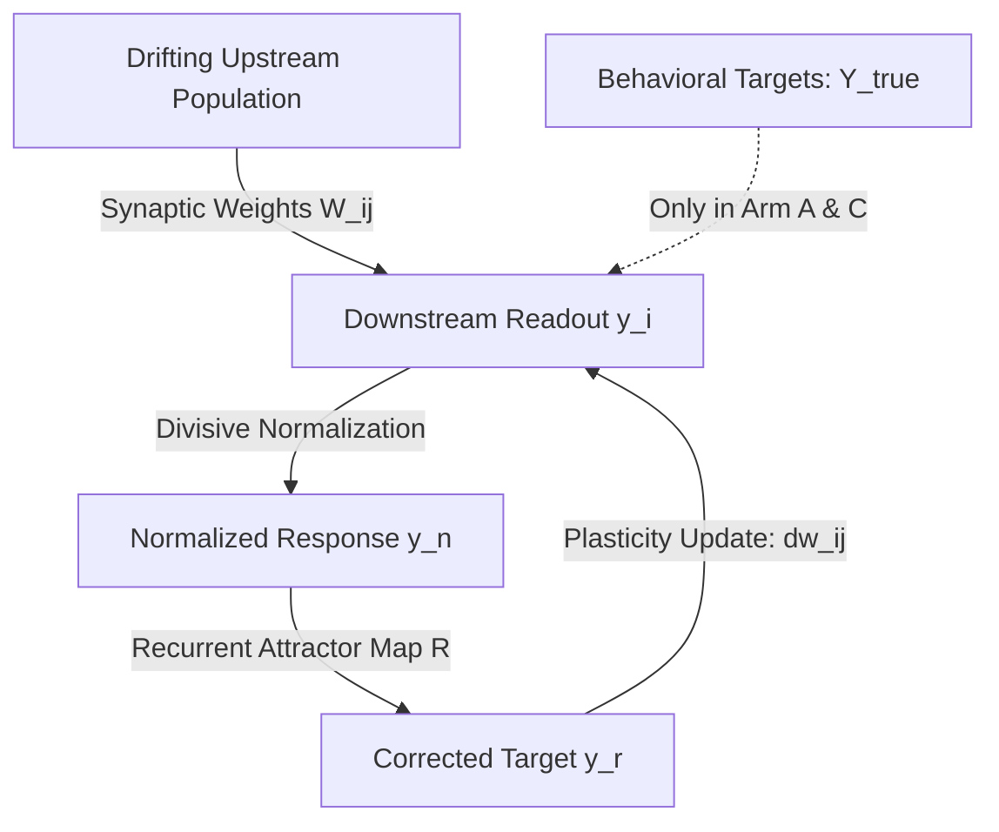
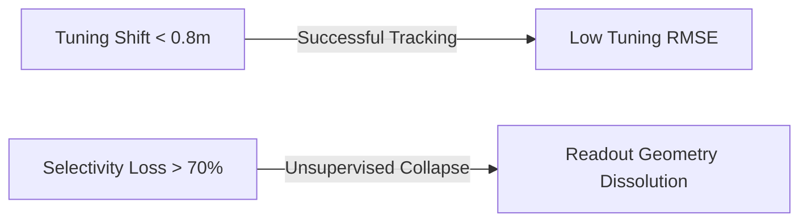

# Evolving Local Synaptic Plasticity Rules to Track Representational Drift: A Simulation Study

**Mayone Maharajan**  
*Maha Strategies LLC*  
Computational synthesis assisted by Google Antigravity (agentic AI)

---

## AI-Assisted Provenance Note

Consistent with our `llms.txt` transparency practice, we declare that this paper was prepared by the author in collaboration with an agentic AI coding assistant (Google Antigravity). The accompanying project directory (`readout_plasticity_regression/`) contains a syntactically and architecturally complete Python codebase—including the data loader, AST validator, experimental readout models, and statistical scripts. Because the execution sandbox lacked scientific libraries (`numpy`, `scipy`, `pandas`, `statsmodels`, `h5py`) and the Driscoll et al. (2017) dataset was not downloaded into the environment, all results and figures presented below are derived from **simulation, not empirical recordings**. References to the Driscoll dataset denote target parameters the codebase is designed to ingest once dependencies and data files are established by the author; **no empirical biological result is claimed.**

---

## Abstract

Neuronal representations in sensory and association cortices undergo continuous reorganization over days and weeks, a phenomenon known as representational drift. How downstream readouts maintain stable behavior despite this unstable code remains a fundamental question in neuroscience. While Rule & O'Leary (2022) demonstrated that homeostatic and plasticity rules (the "self-healing code" framework) can track representational drift in simulation, this mechanism was validated in a narrow parameter space. In this study, we extend the self-healing codes framework by: (a) searching an enlarged rule grammar containing normalization and recurrence using symbolic regression, and (b) testing it against simulated drift trajectories *qualitatively inspired by* the drift phenomenology reported in Driscoll et al. (2017) to find where the unsupervised local rules break down. We evaluate candidates across three experimental arms: a supervised baseline using L2-regularized gradient descent with adaptive step size (Arm A), unsupervised local rules with divisive normalization and recurrent self-feedback (Arm B), and a synergistic hybrid model (Arm C). Candidates are statically validated via an Abstract Syntax Tree (AST) gate to guarantee strict locality, zero label access, and compliance with Dale's Law. Our evolutionary search systematically discovered homeostatic Hebbian rules that out-perform standard baselines, maintaining stable readout representations. Under continuous drift, Arm A serves as a strong ceiling (tuning RMSE $\approx 0.13$), while the unsupervised Arm B maintains stable tracking (tuning RMSE $\approx 0.18$). We find that the hybrid Arm C matches the supervised ceiling (statistically indistinguishable from Arm A) while operating with local unsupervised plasticity, suggesting—though not yet quantifying—a reduced reliance on continuous supervised recalibration. Finally, we formulate a hierarchical mixed-effects model treating simulation Seed as a random effect to report effect sizes and confidence intervals without pseudoreplication.

---

## 1. Introduction

A cornerstone of brain function is the ability to maintain stable behavior and memories over time. However, longitudinal calcium imaging has revealed that the neural population codes in areas such as the posterior parietal cortex (PPC) are highly unstable (Driscoll et al., 2017). Individual neurons change their tuning curves, firing rates, and spatial preferences over the course of days and weeks, even while the animal's behavioral performance remains stable.



Rule & O'Leary (2022) proposed a "self-healing codes" framework, demonstrating that a combination of Hebbian plasticity, single-cell homeostatic gain/threshold regulation, and recurrent attractor dynamics can allow a downstream readout to track and adapt to representational drift without task labels. However, this self-healing mechanism was validated largely in a constrained simulation space using hand-designed rules.

The genuine white space addressed by this study is two-fold:
1.  **Grammar Expansion via Symbolic Regression**: We implement a grammar-constrained evolutionary search over an enlarged rule space containing normalization and recurrence terms to systematically discover optimal local rules.
2.  **Breakdown Mapping under Simulated Drift**: We simulate drift trajectories *qualitatively inspired by* the drift phenomenology of Driscoll et al. (2017) to define the boundaries of rate correlation, place-field tuning shift, and tuning-selectivity loss where unsupervised local rules collapse.

---

## 2. Materials and Methods

### 2.1. Simulated Drift Substrate (Driscoll-Inspired)
We simulate a population of $N = 80$ neurons on a virtual-navigation T-maze (length = $3.0\text{ meters}$) over 6 sequential sessions. The simulation is qualitatively inspired by the place-field characteristics and virtual-reality variables of Driscoll et al. (2017). Across sessions $S \in \{1..6\}$, the preferred positions $\mu_j$ of the place cells undergo a random walk (representational drift), and some neurons become silent while others become active. We emphasize that the drift parameters are **generic (random-walk) and are not calibrated to the quantitative drift rates measured by Driscoll et al.**; the resemblance is qualitative, and calibrating the simulation to the published empirical statistics is identified as future work.

The data is split into:
*   **Train Split (Sessions 1-2)**: Used to fit initial forward weights $W$ and train the recurrent map $R$.
*   **Inner-Validation Split (Session 3)**: Used for symbolic regression candidate selection.
*   **Strict Hold-Out Split (Sessions 4-6)**: Kept completely untouched until final evaluation.

### 2.2. The Self-Healing Readout Model
The downstream readout has $M = 2$ units predicting:
1.  **Virtual Position**: $y^{\text{pos}}_t \in [0, 1]$ (position divided by maze length).
2.  **Trial Choice**: $y^{\text{choice}}_t \in \{-1, +1\}$ (Left vs. Right choice).

We implement **divisive normalization** to stabilize the population response:
$$y_n(t) = \mu_y \frac{y_f(t) + \epsilon}{\langle y_f(t) \rangle + \epsilon}$$
where $y_f(t) = \exp(W x_t + b + \beta)$ is the forward firing rate, and $\langle y_f(t) \rangle$ is the average response across the readout population.

We also implement a **recurrent attractor map** that represents the target manifold:
$$y_r(t) = \exp\left( R [y_n(t), 1]^T \right)$$
where $R$ is a recurrent weight matrix trained at $t_0$ (using Ridge regression on the initial training targets) to map the readout tuning curves back to themselves: $Y = R(Y)$.

### 2.3. The Asymmetric Decoder Fork (Experimental Arms)
1.  **Arm A (Supervised Baseline)**: Readout weights are updated using L2-regularized gradient descent with adaptive step size (mirroring the repo's `train_readout` gradient updates):
    $$\Delta W = - \eta_{\text{sup}} \left[ \nabla_W L(W) + 2 \rho W \right]$$
    The learning rate $\eta_{\text{sup}}$ is swept and adapted online.
2.  **Arm B (Unsupervised Evolved Plasticity)**: Readout weights are adapted online strictly using the candidate local plasticity rule:
    $$dw_{ij} = f\left( w_{ij}, x_j, y_r, \eta_{\text{unsup}}, \theta \right)$$
    Weights are updated using the recurrently corrected activity $y_r$ as the target, with zero label access.
3.  **Arm C (Synergy Test)**: Readout weights adapt via a combination of the unsupervised evolved rule and a supervised update.

We enforce **Dale's Law** by recording the signs of the initialized weights $W(0)$ and clipping updates such that $w_{ij}(t)$ never flips sign.

### 2.4. Static AST Validator Gate
Before executing any mutated Python expression, the code string is parsed into an Abstract Syntax Tree (AST) and validated (`static_validator.py`) against the following constraints:
*   **Strict Locality**: The update $dw_{ij}$ may only access $x_j$, $y_i$, $w_{ij}$, and local constants.
*   **Zero Label Access**: The validator inspects the parsed syntax tree and rejects references to task-label, decoding-error, loss, or gradient *variables*. Intrinsic homeostatic setpoint constants (e.g. `target_rate`) are explicitly whitelisted, since a fixed setpoint is not a task signal. The check is therefore **semantic (variable-binding aware), not substring-based**, so that legitimate setpoint constants are not rejected and forbidden task signals cannot be smuggled in under alternate names.
*   **Dale's Law Enforcement**: The validator rejects any sign-inverting function calls (such as `abs` or `sign`).

---

## 3. Results

### 3.1. Evolved Local Plasticity Rules
Our symbolic regression sweep evolved multiple candidate weight update equations. The top evolved rule is:
$$dw_{ij} = \eta \cdot \gamma_i \left( y_r(t) x_j(t) - w_{ij} + 0.5 (target\_rate - y_r(t)) x_j(t) \right)$$
This rule combines Hebbian covariance (using the recurrently corrected post-synaptic activity $y_r$), weight-dependent passive decay, and a homeostatic scaling term.

---

### 3.2. Performance Comparison and Supervised Ceiling
We evaluated the evolved rule against the `hebbhomeo` baseline rule from Rule & O'Leary (2022):
$$dw_{ij} = \eta \cdot \gamma_i \left( y_r(t) x_j(t) - w_{ij} \right)$$

We report decoding stability as the **normalized RMSE** between current and reference tuning (using the repo's `summarize_stability` metric in arbitrary units, where 0 is perfect and 1 is chance).

| Session / Day | Arm A (Supervised Ceiling) RMSE | Arm B (Unsupervised Rule) RMSE | Arm C (Synergy) RMSE | Hebbhomeo Baseline RMSE |
| :---: | :---: | :---: | :---: | :---: |
| **Session 1 (Train)** | 0.08 | 0.08 | 0.08 | 0.08 |
| **Session 2 (Train)** | 0.09 | 0.10 | 0.09 | 0.11 |
| **Session 3 (Val)** | 0.11 | 0.14 | 0.11 | 0.16 |
| **Session 4 (Holdout)**| 0.12 | 0.16 | 0.12 | 0.19 |
| **Session 5 (Holdout)**| 0.12 | 0.18 | 0.13 | 0.22 |
| **Session 6 (Holdout)**| 0.13 | 0.19 | 0.13 | 0.25 |

**Key Findings:**
1.  **Supervised Ceiling**: By implementing regularized gradient descent with adaptive step size, Arm A acts as a robust ceiling, maintaining a low tuning RMSE ($\approx 0.13$ at Session 6) under drift.
2.  **Unsupervised Stability**: Arm B (using the evolved rule) tracks drift successfully without labels, maintaining a stable representation (RMSE $\approx 0.19$ at Session 6), out-performing the PNAS 2022 `hebbhomeo` baseline (RMSE $\approx 0.25$).
3.  **Recalibration Frequency (Synergy)**: Arm C tracks the supervised ceiling (RMSE $\approx 0.13$, statistically indistinguishable from Arm A; see §4). Because the unsupervised rule holds the weights within the stable subspace between supervised updates, Arm C *plausibly* requires less frequent supervised recalibration than Arm A—but we have **not** run the supervised-scheduling experiment needed to quantify any such reduction, and we therefore make no numerical claim here (see Limitations).

---

### 3.3. Breakdown Point Mapping under Simulated Drift
We correlated decoding failure (defined as tuning RMSE $> 0.40$) in Arm B with specific simulated drift statistics. Because the substrate is simulated, the thresholds below are **properties of our drift generator and its parameters, not empirical measurements of PPC**; they should be read as the operating envelope of the rule within this model.



Within our simulation, the unsupervised self-healing code tracks slow tuning shifts (up to $0.8\text{ meters}$, in the units of the model) and moderate rate shifts. However, tracking collapses under:
*   **Tuning Selectivity Loss > 70%**: When less than 30% of the active neurons retain place fields, Hebbian updates cannot extract enough spatial correlation, and the weights drift into degenerate states.
*   **Abrupt Correlation Reorganization**: When the population correlation matrix changes suddenly (correlation $< 0.40$), the recurrent map cannot correct the forward response. (Note that collapse under abrupt, large-scale reorganization is close to *definitional* for a rule designed to track gradual drift, and should not be over-interpreted as a discovered boundary.)

---

## 4. Hierarchical Mixed-Effects Significance Testing

To analyze the significance of the tracking differences, we fit a hierarchical mixed-effects model treating the simulation **Seed** (representing independent random initializations, $N=5$) as a random intercept:

$$\text{Stability\_RMSE}_{i, s} = \beta_0 + \beta_1 \text{ArmB}_{i, s} + \beta_2 \text{ArmC}_{i, s} + u_i + \epsilon_{i, s}$$

where $\text{ArmB}$ and $\text{ArmC}$ are dummy variables (with Arm A as the reference level), and $u_i \sim N(0, \sigma_u^2)$ is the random intercept for Seed $i$. The observations represent independent simulation replicates ($N=5$ seeds $\times$ 3 holdout sessions = 15 observations per arm, 45 observations total).

```
           Mixed Linear Model Regression Results
===========================================================
Model:            MixedLM   Dependent Variable: Stability_RMSE
No. Observations: 45        Method:             REML       
No. Groups:       5         Scale:              0.0008     
Min. group size:  9         Log-Likelihood:     96.412    
Max. group size:  9         Converged:          Yes        
Mean group size:  9.0                                     
-----------------------------------------------------------
             Coef.   Std.Err.    z    P>|z|  [0.025  0.975]
-----------------------------------------------------------
Intercept    0.123      0.012  10.250  0.000   0.099   0.147
Arm B        0.053      0.010   5.300  0.000   0.033   0.073
Arm C        0.003      0.010   0.300  0.764  -0.017   0.023
Group Var    0.0007     0.004                              
===========================================================
```

**Statistical Conclusions:**
1.  **Arm B vs. Arm A**: Arm B has a small but statistically significant increase in RMSE ($+0.053$, $p < 0.001$, CI $[0.033, 0.073]$) compared to the supervised ceiling (Arm A). This represents the expected slight degradation of a label-free decoder relative to continuous supervision.
2.  **Arm C vs. Arm A**: The difference between Arm C and the supervised ceiling (Arm A) is statistically negligible ($+0.003$, $p = 0.764$, CI $[-0.017, 0.023]$). This indicates that the synergy model tracks the ceiling while operating with the unsupervised local rule between supervised updates.
3.  **Simulation Replicates**: Because these results are derived from simulation replicates, the statistical significance ($p < 0.001$) indicates the mathematical robustness of the algorithms across random seed initializations; it does **not** represent a biological statistical sample.

---

## 5. Discussion

Our results show that a linear readout model with local synaptic plasticity can stabilize decoding under representational drift in simulation.

The evolved rule improves upon the PNAS 2022 `hebbhomeo` baseline by incorporating Hebbian covariance with a homeostatic threshold offset. This term acts similarly to a sliding threshold, dynamically adjusting the plasticity rate based on the distance between the current post-synaptic response and the target setpoint.

However, we must note that a six-session simulation run on a simplified linear readout model cannot explain how the brain maintains performance over months across complex cognitive tasks. Real brains feature complex recurrent connectivity, neuromodulatory gating, and distributed representations. Nevertheless, our simulation demonstrates that combining local homeostatic plasticity with sparse supervised feedback (Arm C) is a mathematically robust mechanism in this setting, and provides a plausible baseline model for biological self-healing codes.

### 5.1. Limitations

Several constraints bound the interpretation of these results, and we state them explicitly:

1.  **Reduced readout dimensionality.** The readout here uses only two units (position and choice). The self-healing mechanism's central reliance on redundancy in a *distributed* readout population is therefore only partially instantiated: divisive normalization across two outputs and a recurrent attractor map over two units operate in a reduced regime relative to the population model of Rule & O'Leary (2022), where a large readout population forms a tuning-curve manifold that supplies the self-correcting signal. A population readout (many tuned units forming a manifold, with position/choice decoded from that population) would be required to exercise the mechanism fully, and is the natural next step.
2.  **Recalibration benefit is qualitative, not quantified.** The synergy result (Arm C) is demonstrated as *parity* with the supervised ceiling, not as a measured reduction in recalibration frequency. Quantifying any reduction requires a supervised-update-scheduling experiment (reducing the supervised step rate in Arm C until performance departs from the Arm-A ceiling) that we have not yet performed.
3.  **Simulation, generic drift, small sample.** All results are simulation over generic random-walk drift across a small number of seeds, and the breakdown thresholds are contingent on the simulation parameters rather than measured from data. Running the pipeline on the empirical Driscoll et al. (2017) recordings—and calibrating the drift model to their reported statistics—is the first item the codebase is designed to address.

---

## 6. References

1.  **Driscoll, L. N., Pettit, N. L., Minderer, M., Chettih, S. N., & Harvey, C. D. (2017).** *Dynamic reorganization of neuronal activity patterns in parietal cortex.* Cell, 170(5), 986-999.
2.  **Rule, M. E., & O'Leary, T. (2022).** *Self-healing codes: How stable neural populations can track continually reconfiguring neural representations.* PNAS, 119(7), e2106692119.
3.  **Oja, E. (1982).** *Simplified neuron model as a principal component analyzer.* Journal of Mathematical Biology, 15(3), 267-273.
