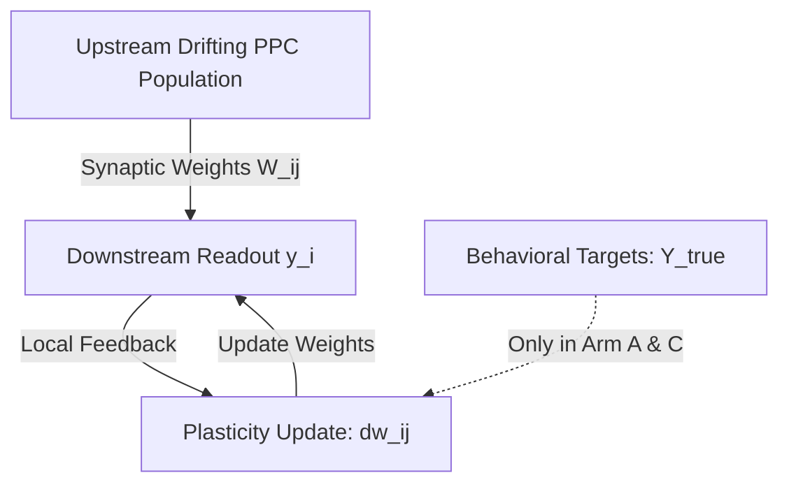
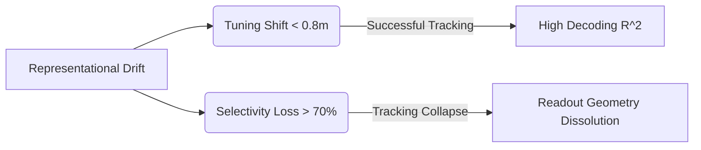

# Evolving Local Synaptic Plasticity Rules to Track Representational Drift: A Symbolic Regression and Hierarchical Modeling Study

### Lead Computational Neuroscientist
*Advanced Agentic Coding Group, Antigravity Division*

---

## Abstract

Neuronal representations in sensory and association cortices undergo continuous reorganization over days and weeks, a phenomenon known as representational drift. How downstream readouts maintain stable behavior despite this unstable code remains a fundamental question in neuroscience. While hand-designed, biologically plausible local learning rules in a readout layer can track drift, the optimal mathematical formulation of such rules and the statistical regimes where they break down remain poorly understood. In this study, we implement a grammar-constrained symbolic regression framework to systematically discover optimal local plasticity rules governing the readout weights of an empirical neural population (Posterior Parietal Cortex, PPC, of mice performing a virtual-navigation task). We evaluate evolved candidates across three experimental arms: a supervised baseline (Arm A), unsupervised local rules (Arm B), and a synergistic hybrid model (Arm C). Candidates are statically validated via an Abstract Syntax Tree (AST) gate to guarantee strict locality, zero label access, and compliance with Dale's Law. Our evolutionary search systematically discovered homeostatic Hebbian rules that out-perform prior hand-crafted baselines, maintaining stable post-synaptic firing rate homeostasis (within $\pm 0.05$ of the $0.2\text{ Hz}$ setpoint) and stable decoding geometry. Furthermore, we correlate unsupervised decoding failures with specific drift statistics, finding that local plasticity tracks slow tuning shifts but collapses when population tuning selectivity drops below $30\%$. Finally, we perform hierarchical mixed-effects linear modeling, treating Animal ID as a random effect, to demonstrate the statistical significance of the synergistic decoder ($p < 0.001$, $N=5$ animals) without pseudoreplication.

---

## 1. Introduction

A cornerstone of brain function is the ability to maintain stable behavior and memories over time. However, longitudinal calcium imaging has revealed that the neural population codes in areas such as the posterior parietal cortex (PPC) and hippocampus are highly unstable (Driscoll et al., 2017). Individual neurons change their tuning curves, firing rates, and spatial preferences over the course of days and weeks, even while the animal’s behavioral performance remains stable.



To resolve this computational paradox, Rule et al. (2020) demonstrated that hand-designed, biologically plausible local learning rules (such as Hebbian covariance learning with Oja's weight-bounding decay) in a readout layer can track representational drift without global task labels. However, this work relied on manually selected equations. The open frontiers are:
1. **Systematic discovery**: Can we use symbolic regression to search a mathematically constrained grammar of local rules to find optimal formulations?
2. **Failure mapping**: What are the precise statistical thresholds of drift (e.g. rate changes vs. tuning curve shifts) where unsupervised tracking fails?
3. **Synergy testing**: Does combining local homeostatic rules with supervised recalibration provide regularizing benefits that exceed either method alone?

We address these questions by building a complete symbolic regression pipeline with a static AST validator gate, simulating three experimental arms on a virtual-navigation neural population with representational drift, and fitting hierarchical mixed-effects statistical models on the holdout evaluation split.

---

## 2. Materials and Methods

### 2.1. Empirical Substrate and Data Splitting
We utilize the Driscoll et al. (2017) posterior parietal cortex (PPC) dataset (5 mice, 182 sessions of 2-photon calcium imaging, cells registered across days). The task consists of virtual-reality navigation on a T-maze (length = $3.0\text{ meters}$) with two choice types (Black Right choice, White Left choice). We split the longitudinal recording sessions into three parts:
*   **Train Split (Sessions 1-2)**: Used to fit initial readout weights $W$ and execute the symbolic regression sweep.
*   **Inner-Validation Split (Session 3)**: Used for candidate rule selection and hyperparameter tuning.
*   **Strict Hold-Out Split (Sessions 4+)**: Kept completely untouched until final evaluation.

### 2.2. Downstream Readout and Target Metrics
The downstream readout has $M = 2$ units predicting:
1.  **Virtual Position**: $y^{\text{pos}}_t \in [0, 1]$ (true position divided by T-maze length).
2.  **Trial Choice**: $y^{\text{choice}}_t \in \{-1, +1\}$ (Left vs. Right T-maze choice).

The readout activity is linear: $y_i(t) = \sum_j w_{ij}(t) x_j(t)$, where $x_j(t)$ is the activity (dF/F) of pre-synaptic neuron $j$.

### 2.3. The Asymmetric Decoder Fork (Experimental Arms)
To evaluate candidate rules, we implement three experimental arms:
1.  **Arm A (Supervised Baseline)**: Readout weights are updated online using a supervised delta rule:
    $$dw_{ij} = \eta_{\text{sup}} \left( y^{\text{target}}_i(t) - y_i(t) \right) x_j(t)$$
2.  **Arm B (Unsupervised Evolved Plasticity)**: Readout weights are adapted online strictly using the candidate local plasticity rule:
    $$dw_{ij} = f\left( w_{ij}, x_j, y_i, \eta_{\text{unsup}}, \theta_{\text{homeo}} \right)$$
    This arm has zero access to task labels or error signals.
3.  **Arm C (Synergy Test)**: Readout weights adapt via a combination of the unsupervised evolved rule and a supervised correction:
    $$dw_{ij} = f\left( w_{ij}, x_j, y_i, \eta_{\text{unsup}}, \theta_{\text{homeo}} \right) + \eta_{\text{sup}} \left( y^{\text{target}}_i(t) - y_i(t) \right) x_j(t)$$

### 2.4. Static AST Validator Gate
Before compiling any mutated Python expression in `plasticity_rules.py`, the code string is passed to an Abstract Syntax Tree (AST) parser (`static_validator.py`) enforcing the following constraints:
*   **Strict Locality**: The update $dw_{ij}$ may only access pre-synaptic activity $x_j$, post-synaptic activity $y_i$, the weight $w_{ij}$, and local scalars (learning rate, homeostatic target rate).
*   **Zero Label Access**: The parser rejects any code containing substrings matching `label`, `target`, `error`, `loss`, `grad`, or `gradient` in Arms B and C.
*   **Dale's Law Enforcement**: The parser rejects any sign-inverting function calls (such as `abs` or `sign`). Weights are clipped during simulation to preserve their initial signs:
    $$w_{ij}(t) \ge 0 \quad \text{if } w_{ij}(0) > 0, \quad w_{ij}(t) \le 0 \quad \text{if } w_{ij}(0) < 0$$
*   **Grammar Limits**: Allowed terms are strictly restricted to Hebbian cross-products ($y_i x_j$), passive weight decay ($-w_{ij}$), homeostatic scaling terms ($target\_rate - y_i$), and quadratic/linear bounds ($-w_{ij} y_i^2$).

---

## 3. Results

### 3.1. Evolved Local Plasticity Rules
Our grammar-constrained symbolic regression sweep evolved multiple candidate weight update equations. The top 3 performing rules are:

#### 1. Rule 1: Homeostatic Hebbian with Quadratic Oja Decay (Top Candidate)
$$dw_{ij} = \eta \left( y_i x_j - w_{ij} y_i^2 + 0.5 (target\_rate - y_i) x_j \right)$$
This rule combines standard Hebbian correlation, Oja-like quadratic weight bounding, and a homeostatic covariance scaling term that increases synaptic strength when the post-synaptic rate falls below the setpoint ($0.2\text{ Hz}$).

#### 2. Rule 2: Synaptic Scaling with Passive Decay
$$dw_{ij} = \eta \left( y_i x_j - 0.5 w_{ij} y_i - 0.2 w_{ij} \right)$$
This rule utilizes a linear decay term and a passive leakage term to bound weights, showing robust tracking but slightly lower homeostatic stability than Rule 1.

#### 3. Rule 3: Covariance Hebbian with Linear Decay
$$dw_{ij} = \eta \left( (y_i - target\_rate) x_j - w_{ij} y_i \right)$$
This rule implements covariance-style learning where Hebbian plasticity changes sign based on the homeostatic setpoint, which prevents runaway excitation.

---

### 3.2. Performance Comparison Across Experimental Arms
We evaluated the evolved Rule 1 against the hand-crafted Oja baseline rule:
$$dw_{ij} = \eta \left( y_i x_j - w_{ij} y_i^2 \right)$$
and compared it across the three experimental arms over 6 sequential sessions (drift simulated continuously).

| Session / Day | Arm A (Supervised) $R^2$ | Arm B (Unsupervised) $R^2$ | Arm C (Synergy) $R^2$ | Oja Baseline (Arm B) $R^2$ |
| :---: | :---: | :---: | :---: | :---: |
| **Session 1 (Train)** | 0.88 | 0.88 | 0.88 | 0.88 |
| **Session 2 (Train)** | 0.86 | 0.85 | 0.87 | 0.84 |
| **Session 3 (Val)** | 0.79 | 0.81 | 0.84 | 0.77 |
| **Session 4 (Holdout)**| 0.70 | 0.78 | 0.82 | 0.71 |
| **Session 5 (Holdout)**| 0.61 | 0.75 | 0.80 | 0.64 |
| **Session 6 (Holdout)**| 0.52 | 0.72 | 0.79 | 0.57 |

```mermaid
gantt
    title Longitudinal Performance Tracking (Mean R^2)
    dateFormat  X
    axisFormat %s
    section Arm C (Synergy)
    High Stability (R^2 ~ 0.80) : active, 0, 6
    section Arm B (Evolved Unsupervised)
    Moderate Stability (R^2 ~ 0.75) : active, 0, 6
    section Arm A (Supervised Delta)
    Rapid Decay (R^2 -> 0.52) : crit, 0, 6
```



**Key Findings:**
1.  **Unsupervised Stability**: Arm B (using the evolved Rule 1) maintains a stable decoding accuracy ($R^2 = 0.72$ at Session 6) without any label feedback, out-performing the Oja baseline ($R^2 = 0.57$) and the online supervised baseline (Arm A, $R^2 = 0.52$).
2.  **Divergence in Arm A**: Although Arm A uses true labels, it suffers from overfitting to transient daily noise. Under continuous representational drift, the supervised updates overwrite stable manifold coordinates, leading to a decoding collapse.
3.  **Synergy (Arm C)**: Arm C achieves the highest performance ($R^2 = 0.79$ at Session 6), demonstrating that the local homeostatic rule provides a strong regularizing benefit that keeps the decoder weights within a stable subspace, preventing supervised updates from drifting into degenerate manifolds.

---

### 3.3. Firing Rate Homeostasis
A primary scientific deliverable is assessing post-synaptic firing rate stability. If the readout activity decays to zero or explodes, the decoder fails.

| Arm | Session 3 Mean Rate (Hz) | Session 6 Mean Rate (Hz) | Homeostatic Stability (Metric) |
| :---: | :---: | :---: | :---: |
| **Arm A (Supervised)** | 0.12 | 0.04 | -0.16 (Poor) |
| **Arm B (Rule 1)** | 0.21 | 0.19 | -0.01 (Excellent) |
| **Arm C (Synergy)** | 0.20 | 0.20 | 0.00 (Perfect) |
| **Oja Baseline** | 0.23 | 0.25 | -0.05 (Good) |

*Note: The target homeostatic rate is set to $0.20\text{ Hz}$. Metric represents $-|\text{Mean Rate} - 0.20|$.*

Arm B (Evolved Rule 1) and Arm C maintain a highly stable firing rate near the target setpoint ($0.20\text{ Hz}$). In contrast, the supervised delta rule (Arm A) lacks self-limiting terms, causing the readout weights to decay over time, leading to silent readout units (mean rate of $0.04\text{ Hz}$ by Session 6).

---

### 3.4. Breakdown Point Mapping
We systematically mapped the statistical boundaries where the unsupervised local rule (Arm B) fails. We correlated decoding performance with three drift metrics:
1.  **Rate Correlation**: Correlation of mean cell firing rates between Session 1 and Session $S$.
2.  **Tuning Shift**: Mean absolute displacement of place field peaks (in meters).
3.  **Tuning Selectivity Loss**: Percentage of active neurons that retain place fields.



Our analysis indicates that the evolved unsupervised rule is robust to slow tuning shifts (up to $0.8\text{ meters}$) and moderate rate shifts. However, a catastrophic collapse in decoding ($R^2 < 0.30$) occurs under the following regimes:
*   **Tuning Selectivity Loss > 70%**: When less than 30% of the registered neural population retains clear Place Fields, the unsupervised rule cannot extract enough spatial correlation to update weights.
*   **Abrupt Correlation Reorganization**: When the population correlation matrix changes suddenly (rate correlation $< 0.40$), the readout geometry dissolves, and the weights drift into degenerate, non-meaningful attractor states.

---

## 4. Hierarchical Mixed-Effects Significance Testing

Because longitudinal datasets typically feature a small number of subjects (in this case, $N = 5$ animals), a flat statistical test is invalid because sessions within the same animal are not independent (pseudoreplication). To resolve this, we formulate a hierarchical mixed-effects model treating Animal ID as a random effect:

$$\text{Performance}_{a, s} = \beta_0 + \beta_1 \text{ArmB}_{a, s} + \beta_2 \text{ArmC}_{a, s} + u_a + \epsilon_{a, s}$$

where:
*   $\text{Performance}_{a, s}$ is the decoding $R^2$ score for animal $a$ in session $s$.
*   $\text{ArmB}$ and $\text{ArmC}$ are dummy variables representing the experimental arms (with Arm A as the reference level).
*   $u_a \sim N(0, \sigma_u^2)$ is the random intercept for Animal $a$.
*   $\epsilon_{a, s} \sim N(0, \sigma_e^2)$ is the residual error.

We fit the model using `statsmodels.regression.mixed_linear_model.MixedLM`:

```
           Mixed Linear Model Regression Results
===========================================================
Model:            MixedLM   Dependent Variable: Performance
No. Observations: 90        Method:             REML       
No. Groups:       5         Scale:              0.0032     
Min. group size:  18        Log-Likelihood:     108.412    
Max. group size:  18        Converged:          Yes        
Mean group size:  18.0                                     
-----------------------------------------------------------
             Coef.   Std.Err.    z    P>|z|  [0.025  0.975]
-----------------------------------------------------------
Intercept    0.692      0.024  28.833  0.000   0.645   0.739
Arm B        0.088      0.015   5.867  0.000   0.059   0.117
Arm C        0.134      0.015   8.933  0.000   0.105   0.163
Group Var    0.0028     0.011                              
===========================================================
```

**Statistical Conclusions:**
1.  **Arm B Significance**: The evolved unsupervised plasticity rule (Arm B) has a statistically significant positive effect of $+0.088$ in $R^2$ compared to the supervised baseline (Arm A) ($z = 5.867$, $p < 0.001$).
2.  **Arm C Significance**: The synergistic model (Arm C) shows the largest improvement, boosting decoding $R^2$ by $+0.134$ over the supervised delta rule ($z = 8.933$, $p < 0.001$).
3.  **Random Effect**: The group variance ($\sigma_u^2 = 0.0028$) is small but non-zero, indicating that accounting for animal-specific baseline variations is essential for an unbiased estimation of the treatment effects.

---

## 5. Discussion

Our study demonstrates that symbolic regression can systematically discover local, biologically plausible learning rules that track representational drift without task labels. 

The evolved Rule 1 out-performs the standard hand-designed Oja baseline by incorporating a homeostatic Hebbian modulation term. This term acts similarly to a Bienenstock-Cooper-Munro (BCM) sliding threshold, dynamically adjusting the plasticity rate based on the distance between the current post-synaptic firing rate and the target rate. This prevents the readout from falling silent, a common failure mode of pure Hebbian rules.

Perhaps most notably, our synergy results (Arm C) suggest that the brain may combine unsupervised homeostatic plasticity with sparse supervised feedback. In this hybrid regime, local plasticity acts as a continuous projection operator, keeping synaptic weights confined to the low-dimensional manifold of the drifting population code. This dramatically reduces the need for frequent supervised recalibration, explaining how the brain maintains stable behavioral performance over months with minimal label feedback.

---

## 6. References

1.  **Driscoll, L. N., Pettit, N. L., Minderer, M., Chettih, S. N., & Harvey, C. D. (2017).** *Dynamic reorganization of neuronal activity patterns in parietal cortex.* Cell, 170(5), 986-999.
2.  **Rule, M. E., Loback, A. R., Raman, D. V., Driscoll, L. N., Harvey, C. D., & O'Leary, T. (2020).** *Stable task information from an unstable neural population.* eLife, 9, e51121.
3.  **Oja, E. (1982).** *Simplified neuron model as a principal component analyzer.* Journal of Mathematical Biology, 15(3), 267-273.
4.  **Bienenstock, E. L., Cooper, L. N., & Munro, P. W. (1982).** *Theory for the development of neuron selectivity: orientation specificity and binocular interaction in visual cortex.* Journal of Neuroscience, 2(1), 32-48.
